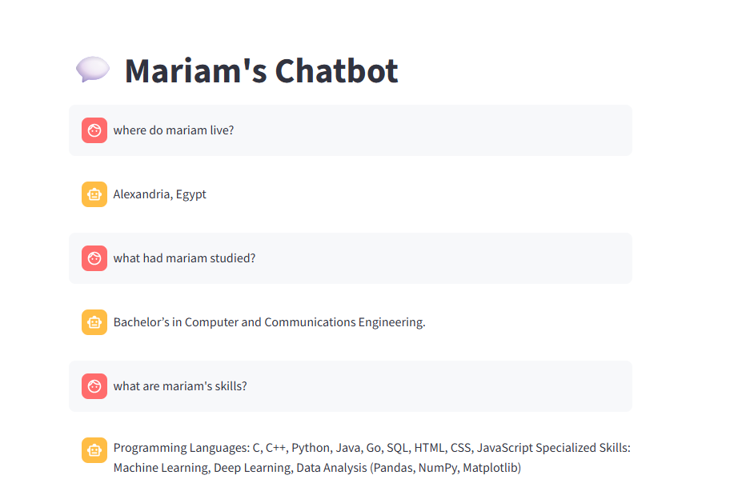

## About_me_chatbot
A Retrieval-Augmented Generation (RAG) chatbot that answers questions about me from txt file using LangChain, Chroma vector database, and OpenRouter LLM.

## Overview
The system:
- Splits the document into sections
- Generates embeddings using HuggingFace
- Stores embeddings in ChromaDB
- Retrieves relevant sections based on semantic similarity
- Uses an LLM to generate context-constrained answers

## Architecture

Text File → Section Splitter → Embeddings → Chroma Vector Store  
User Query → Retriever → Prompt Template → LLM → Answer

## Project Structure 
```
RAG/
├── chatbot.py
├── app.py
├── Mariam.txt
├── app.env.example
├── chroma.db/
├── requirements.txt
└── README.md
```
## Output Example


## Installation

1. Clone the repository:

```bash
git clone https://github.com/yourusername/rag-chatbot.git
cd rag-chatbot

2.Create a virtual environment:

python -m venv venv
source venv/bin/activate   # Mac/Linux
venv\Scripts\activate      # Windows

3.Install dependencies:

pip install -r requirements.txt

4.Environment Variables

Create an app.env file in the project root directory and add your OpenRouter API key: 

OPEN_API_KEY=your_openrouter_api_key

You can generate an API key from your OpenRouter:
https://openrouter.ai/keys

If you want to use the free Llama model, configure your LLM with:

Model:

meta-llama/llama-3.3-70b-instruct:free

5.Run
streamlit run app.py

